# Consultorio · Turnos online e historia clínica

Sistema completo para un consultorio médico, con oftalmología como primer caso. El paciente saca turno desde la web en dos minutos y después lo confirma, lo cambia o lo cancela con un link, sin llamar. El consultorio maneja la agenda, la historia clínica, las recetas, la lista de espera y la caja desde un solo panel, con permisos por rol.

Lo importante no se resuelve en la interfaz sino en la base de datos: dos personas no pueden reservar el mismo horario, la historia clínica no se borra y la auditoría no se puede modificar.

> Proyecto de portfolio con datos 100 % ficticios. Desarrollado por [Sync Solutions](https://instagram.com/sync.tuc).

<p align="center">
  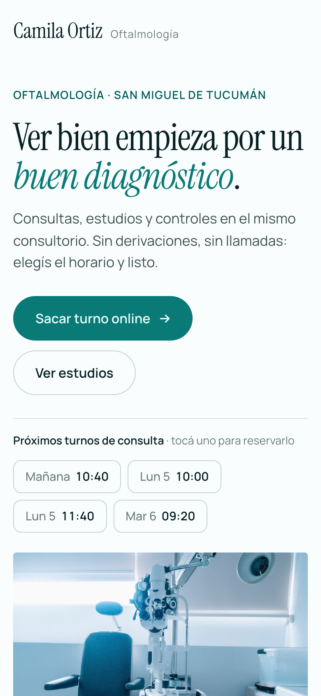
  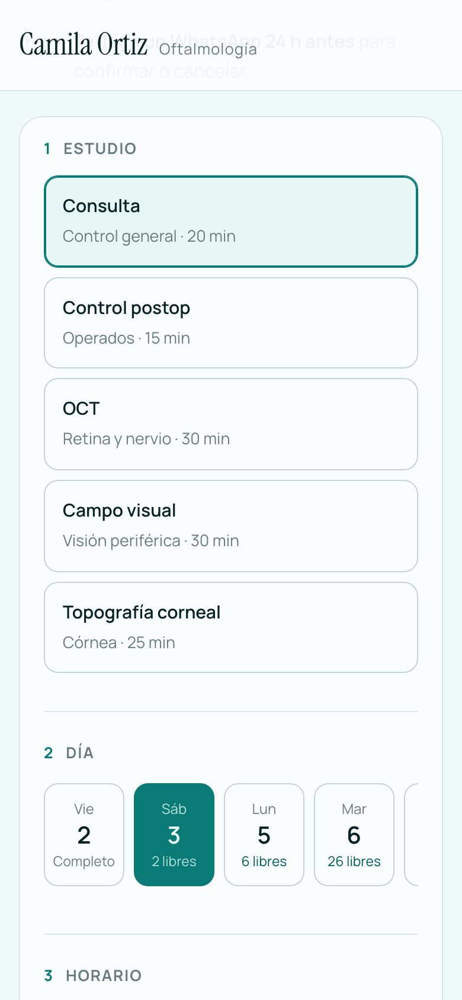
  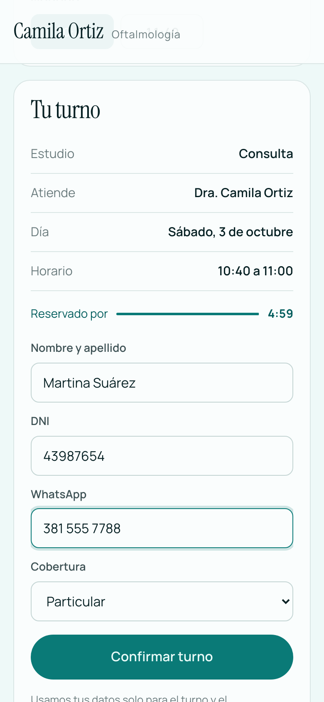
  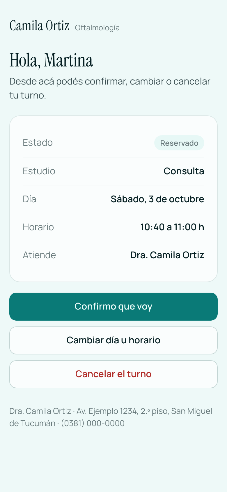
</p>

<p align="center">
  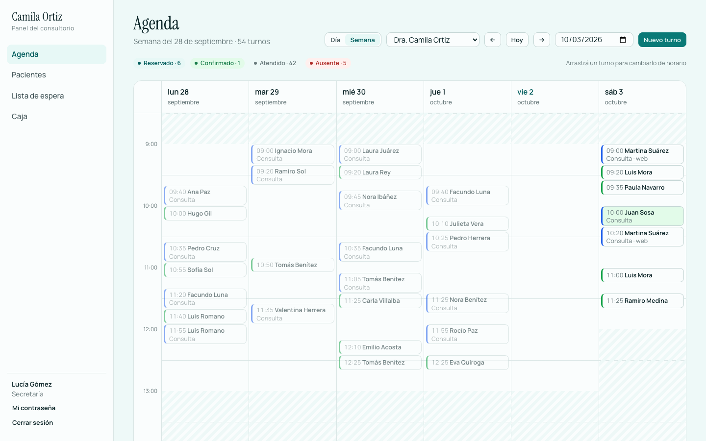<br>
  <sub>Agenda semanal. Los turnos se mueven arrastrándolos; los que entraron por la web dicen "web".</sub>
</p>

---

## Qué hace

### Para el paciente

| | |
|---|---|
| **Turnero online** | Elige estudio, día y horario. Solo ve horarios donde el estudio entra completo, según su duración, el profesional y el equipo que usa. |
| **Horario retenido 5 minutos** | Al elegir un horario, nadie más lo puede tomar mientras completa sus datos, como en la venta de entradas. Si cierra la página, se libera solo. |
| **Link para gestionar el turno** | Llega con la confirmación y con el recordatorio. Desde ahí confirma, elige otro horario o cancela, hasta 2 horas antes. No muestra DNI ni teléfono, por si el link se reenvía. |
| **Recordatorio por WhatsApp** | 24 horas antes. Puede responder "Sí", "Confirmo" o "Cancelar" y el sistema le contesta. |
| **Aviso de lista de espera** | Si quería venir antes y se libera un horario, le llega un WhatsApp con un link que abre la web con ese horario ya elegido. |

### Para la secretaría

| | |
|---|---|
| **Agenda diaria y semanal** | Columnas por profesional (o por día en la semana), horarios de atención, bloqueos, y una línea roja con la hora actual. Se actualiza sola cada 30 segundos. |
| **Arrastrar y soltar** | Se mueve un turno arrastrándolo. Antes de guardar pide confirmación, y el paciente recibe un recordatorio nuevo. |
| **Estados del turno** | Reservado → confirmado → en sala → atendido, con cancelado y ausente. Solo se ofrecen los pasos válidos. |
| **Lista de espera** | "Quiere venir antes" la anota con un clic. El sistema avisa solo cuando se libera un horario y la saca de la lista cuando reserva. |
| **Caja del día** | "Cobrar" desde el turno trae el paciente y el precio del estudio. Totales por medio de pago, pagos anulables (nunca borrados) y cierre imprimible con lugar para firmas. La agenda marca con **$** lo cobrado. |
| **Pacientes** | Búsqueda por nombre o DNI sin importar tildes, datos de contacto y cobertura. La secretaria no ve contenido clínico, ni siquiera llamando a la API. |

### Para la médica

| | |
|---|---|
| **Historia clínica** | Ficha armada desde una plantilla de la especialidad: agudeza visual, refracción, presión ocular, biomicroscopía y fondo de ojo. |
| **Historial de cambios** | Cada corrección queda con fecha, usuario y valor anterior, y se ve como un *diff*. Las consultas no se borran: se anulan con motivo. |
| **Recetas** | Anteojos y lentes de contacto (con la refracción de la ficha), medicación y órdenes de estudio. Salen listas para imprimir o guardar como PDF, con su título y matrícula. |
| **Sobreturnos y bloqueos** | Puede dar un sobreturno a propósito y bloquear horarios (cirugías, congresos). El bloqueo devuelve los turnos que hay que reprogramar. |

### Para administración

| | |
|---|---|
| **Configuración** | Datos del consultorio, usuarios y contraseñas, estudios (duración, equipo, precio, profesional, color y descripción), horarios de atención, obras sociales y equipos. La web, el panel y las recetas toman todo de ahí. |
| **Reportes** | Turnos del mes, ausentismo, reservas online e ingresos. Prestaciones atendidas por obra social, con descarga en CSV listo para Excel. |
| **Auditoría** | Quién hizo qué y cuándo, con el antes y el después. El contenido clínico se oculta incluso para el admin. También muestra quién abrió cada historia clínica. |

<p align="center">
  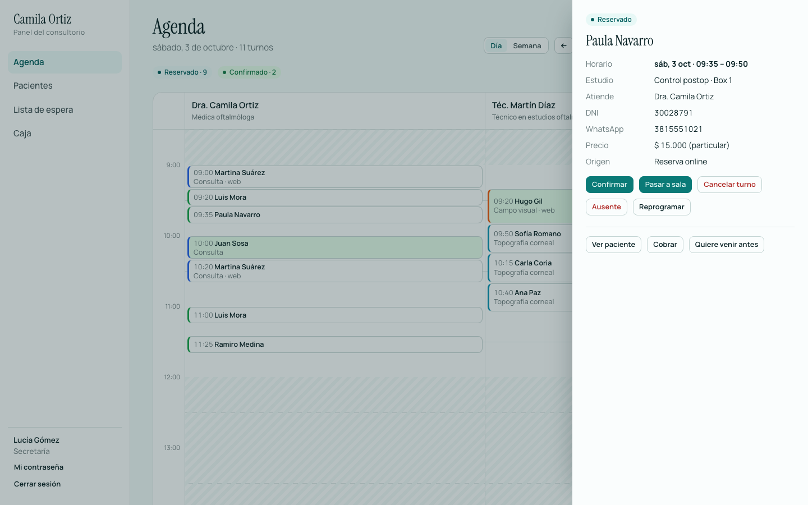
  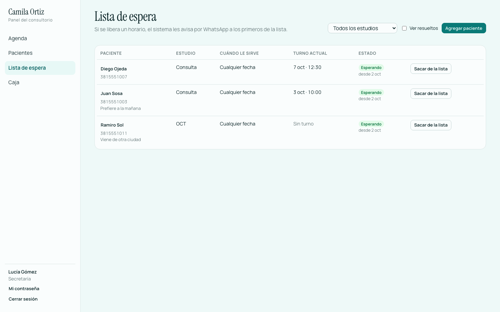
</p>
<p align="center">
  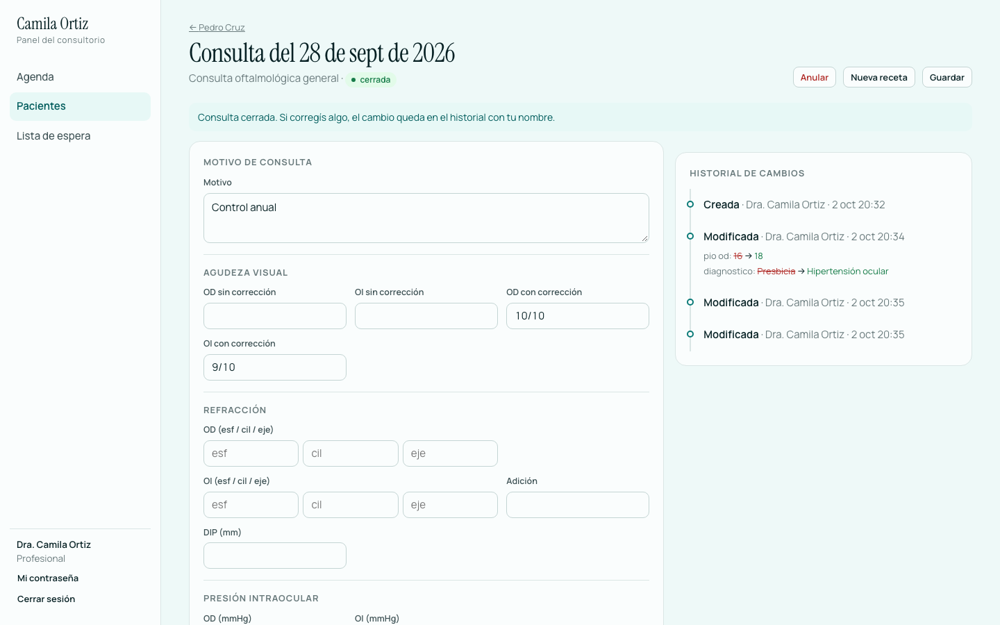
  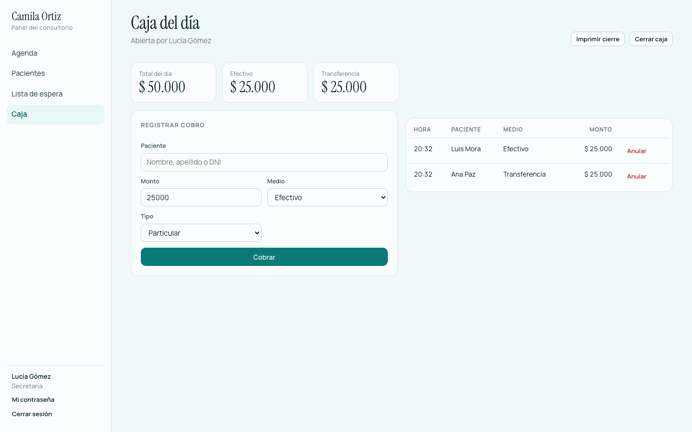
</p>
<p align="center">
  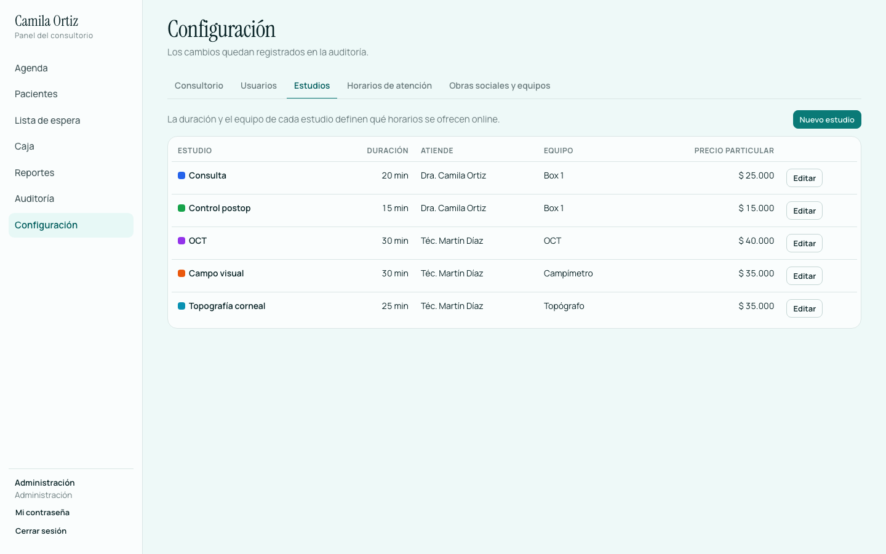
  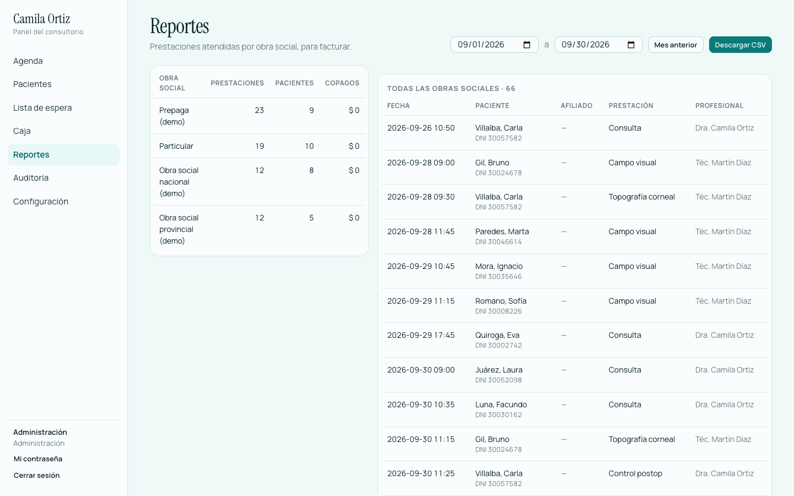
</p>

---

## Cómo está hecho

### Dos personas, el mismo horario: entra una sola

El choque de turnos se resuelve en la base, con un `EXCLUDE` de PostgreSQL sobre rangos de tiempo:

```sql
CONSTRAINT sin_choque_profesional EXCLUDE USING gist (
    profesional_id WITH =,
    tstzrange(inicio, fin) WITH &&
) WHERE (estado NOT IN ('cancelado', 'ausente') AND NOT sobreturno)
```

Hay otro igual por **equipo** (OCT, campímetro, topógrafo), así que dos estudios tampoco pueden usar el mismo aparato a la vez. La API convierte el error en un `409` con un mensaje para el paciente.

`npm run carrera -- 50` lo prueba contra la API en marcha con 50 reservas simultáneas al mismo horario:

```
50 reservas simultáneas para 3/10/2026, 11:40:00…
  201 retenido: 1
  409 ocupado:  49
✔ Exactamente una reserva. La base no permitió el choque.
```

### La base no confía en el cliente

- Un trigger calcula el fin del turno desde la duración del estudio y le asigna el equipo.
- Rechaza turnos online fuera del horario de atención, con menos de una hora de anticipación o sobre un bloqueo.
- Otro trigger registra cada horario que se libera (por el panel, por WhatsApp o por el link del paciente) para ofrecérselo a la lista de espera.

### Historia clínica auditada e inmutable

- Cada cambio en pacientes, turnos, consultas, recetas, pagos y configuración queda en `audit_log` con el valor anterior, el nuevo y el usuario.
- `audit_log` no se puede modificar ni borrar, y las consultas no se pueden borrar: lo impiden triggers de la base.
- Cada vez que alguien abre una historia clínica queda registrado.

### WhatsApp

Sin credenciales, los mensajes se imprimen por consola: sirve para desarrollar y para la demo. Con credenciales usa la WhatsApp Cloud API de Meta:

- **Plantillas aprobadas** para los recordatorios y los avisos de lista de espera (fuera de la ventana de 24 h, Meta solo acepta plantillas).
- **Webhook real:** responde la verificación de Meta, valida la firma `X-Hub-Signature-256` y entiende texto y botones.
- **Números argentinos:** "0381 15 555-1234" se convierte a `5493815551234`.
- El worker usa `FOR UPDATE SKIP LOCKED`, así que pueden correr varios a la vez sin mandar dos veces el mismo mensaje. Si un envío falla, reintenta hasta 3 veces.

### Arquitectura

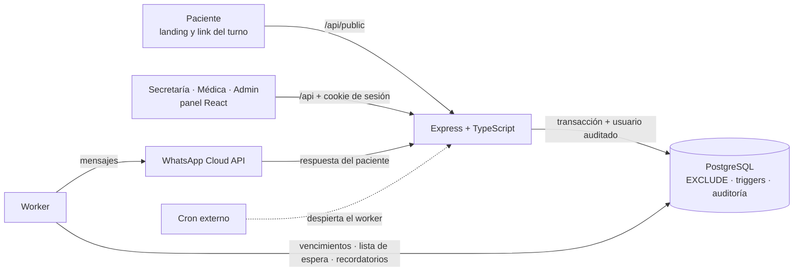

## Estructura

```
db/migrations/          001 esquema · 002 reserva online · 003 API · 004 bloqueos · 005 gestión
api/                    Express + TypeScript + pg + zod
  src/lib/              db (transacciones auditadas), auth, agenda, errores, whatsapp
  src/routes/           public · agenda · clinica · caja · admin · webhooks
  src/worker.ts         vencimientos, lista de espera y recordatorios
  scripts/              migrate · seed · backup · carrera
  test/                 51 tests de integración contra Postgres real
panel/                  React + Vite + TypeScript
  src/pages/            agenda, pacientes, consulta, lista de espera, caja, reportes, auditoría, configuración
  e2e/                  9 escenarios de punta a punta con Playwright
web/landing/            landing con turnero (index.html) y gestión del turno (turno.html), sin frameworks
docs/                   capturas para este README
.github/workflows/      CI (typecheck, build, tests y e2e) · cron que despierta el worker
docker-compose.yml      Postgres local
render.yaml             deploy en Render
```

## Verlo en tu compu

Necesitás Node 22 y Docker (o un PostgreSQL 16 o más nuevo).

```bash
docker compose up -d          # Postgres en localhost:5432 (crea también la base de test)
cp .env.example .env
npm install
npm run migrate
npm run seed                  # datos de demo
npm run build -w panel        # compila el panel
npm run dev                   # http://localhost:3000
```

- Landing: <http://localhost:3000>
- Panel: <http://localhost:3000/panel> (para desarrollar el panel con recarga en caliente: `npm run dev -w panel` → <http://localhost:5173/panel>)

| Usuario | Email | Contraseña |
|---|---|---|
| Secretaría | secretaria@demo.com | demo1234 |
| Médica | dra@demo.com | demo1234 |
| Técnico de estudios | tecnico@demo.com | demo1234 |
| Administración | admin@demo.com | demo1234 |

Para empezar de cero: `npm run migrate -- --reset && npm run seed`.

Los WhatsApp se imprimen en la consola del servidor. Para simular que el paciente responde:

```bash
curl -X POST localhost:3000/api/webhooks/whatsapp -H 'Content-Type: application/json' \
  -H 'x-webhook-secret: cambiame' -d '{"telefono":"3815551003","texto":"Sí"}'
```

## Tests

```bash
npm test                          # 51 tests de integración (API + base real)
npx playwright install chromium   # una sola vez
npm run e2e                       # 9 escenarios en un navegador real
```

Los de integración corren contra la base `consultorio_test`, que se recrea en cada corrida. Cubren la reserva y las 50 reservas simultáneas, los choques por equipo, las retenciones vencidas, el horario de atención, los roles, la historia clínica y su auditoría, las recetas, la máquina de estados, los bloqueos, el webhook de Meta (firma y verificación), la caja, la autogestión del paciente, la lista de espera, la configuración, los reportes y el cron.

Los de punta a punta manejan la landing y el panel como lo haría una persona: reservar y gestionar el turno con el link, la vista semanal, arrastrar un turno, la lista de espera y el cobro, la receta, la configuración y los reportes.

CI (GitHub Actions) corre todo en cada push: typecheck, build, tests de integración contra Postgres y Playwright.

## Antes de usarlo con pacientes reales ✅

1. **Usuarios:** sacá `SEED_DEMO` y creá los usuarios reales en **Configuración → Usuarios**. Cada uno cambia su contraseña desde "Mi contraseña".
2. **Datos del consultorio:** completá nombre, dirección, teléfono, WhatsApp y horarios en **Configuración → Consultorio**, y los estudios con sus precios. La presentación del profesional, las fotos y las preguntas frecuentes de la landing están en `web/landing/index.html`.
3. **WhatsApp:** creá la app en Meta, aprobá las plantillas de recordatorio y de lista de espera (cuerpo con 4 variables: nombre, estudio, fecha y hora, link) y cargá las variables de abajo. En Meta, el webhook va a `https://tu-dominio/api/webhooks/whatsapp` con tu `WHATSAPP_VERIFY_TOKEN`.
4. **Worker siempre despierto:** un plan que no duerma el servidor, o el workflow `despertar.yml` con los secretos `SITE_URL` y `CRON_SECRET` cargados en GitHub. Llama a `POST /api/interno/ciclo` cada 10 minutos.
5. **Backups:** una base con backups automáticos y, además, `npm run backup` programado en otra máquina. Hace un `pg_dump` y conserva los últimos 30; cómo restaurar está en `api/scripts/backup.ts`. Los archivos tienen historias clínicas: guardalos cifrados.
6. **Revisión legal:** el diseño sigue las buenas prácticas de historia clínica digital (Ley 26.529) y de datos sensibles (Ley 25.326), pero falta una revisión legal y encriptado en reposo.

### Variables de entorno

| Variable | Para qué |
|---|---|
| `DATABASE_URL` · `DATABASE_SSL` | Conexión a Postgres (`DATABASE_SSL=true` en bases administradas). |
| `PUBLIC_URL` | URL del sitio para los links de WhatsApp. En Render se toma sola. |
| `RUN_WORKER` | `true` corre el worker dentro del servidor. |
| `SEED_DEMO` | `true` carga los usuarios de demo en producción. Nunca con pacientes reales. |
| `WHATSAPP_TOKEN` · `WHATSAPP_PHONE_ID` | Credenciales de la WhatsApp Cloud API. Sin ellas, los mensajes van a la consola. |
| `WHATSAPP_VERIFY_TOKEN` · `WHATSAPP_APP_SECRET` | Verificación y firma del webhook de Meta. |
| `WHATSAPP_TEMPLATE_RECORDATORIO` · `WHATSAPP_TEMPLATE_LISTA_ESPERA` · `WHATSAPP_TEMPLATE_LANG` | Nombres e idioma de las plantillas aprobadas. |
| `WEBHOOK_SECRET` | Webhook simple `{ telefono, texto }` para pruebas. |
| `CRON_SECRET` | Protege `POST /api/interno/ciclo`. |
| `BACKUP_DIR` · `BACKUP_KEEP` | Dónde guardar los backups y cuántos conservar. |

## Publicar

**Render:** *New → Blueprint* con este repo. `render.yaml` crea el servicio web y la base. Al arrancar migra, carga la demo si la base está vacía (con `SEED_DEMO=true`) y levanta landing, panel, API y worker en un solo servicio.

> En el plan gratis, Render duerme el servicio cuando no hay tráfico (y con él, el worker). Según sus condiciones al momento de escribir esto, el Postgres gratis vence a los 30 días y no tiene backups. Para la demo alcanza; con pacientes reales, usá planes pagos o el cron de arriba.

**Railway u otro hosting con Node:** un servicio desde el repo más un Postgres. Variables mínimas: `DATABASE_URL`, `DATABASE_SSL=true`, `NODE_ENV=production`, `RUN_WORKER=true`. Build: `npm ci --include=dev && npm run build`. Start: `npm run migrate && npm run seed && npm start`.

## API (resumen)

| Método | Ruta | Quién |
|---|---|---|
| GET | `/api/public/consultorio` · `/tipos` · `/disponibilidad?tipo=&desde=&dias=` | público |
| POST | `/api/public/retenciones` → `{ token, expira_at }` · `/:token/confirmar` → `{ link_gestion }` · `/:token/liberar` | público (con límite de pedidos) |
| GET/POST | `/api/public/turnos/:token` · `/confirmar` · `/cancelar` · `/reprogramar` | paciente con el link |
| POST | `/api/auth/login` · `/logout` · `/password` · GET `/api/auth/yo` | — |
| GET/POST | `/api/turnos?dia=&dias=&profesional=` · GET `/api/turnos/:id` | staff |
| PATCH | `/api/turnos/:id/estado` · `/api/turnos/:id/horario` | staff |
| GET/POST | `/api/lista-espera` · POST `/:id/resolver` | staff |
| GET/POST/PATCH | `/api/pacientes` · `/api/catalogos` | staff |
| GET/POST/DELETE | `/api/bloqueos` | médica, admin |
| GET | `/api/pacientes/:id/historia` | médica |
| POST/PATCH/GET | `/api/consultas` · `/cerrar` · `/anular` · `/historial` · `/recetas` · `/api/recetas/:id/imprimir` | médica |
| GET/POST | `/api/caja/hoy` · `/abrir` · `/cerrar` · `/imprimir?fecha=` · `/api/pagos` · `/anular` | secretaría, admin |
| GET | `/api/admin/auditoria` · `/accesos` · `/reportes/mes` · `/reportes/obras-sociales?desde=&hasta=&formato=csv` | admin |
| GET/POST/PATCH/PUT/DELETE | `/api/admin/usuarios` · `/tipos` · `/horarios` · `/obras-sociales` · `/recursos` · `/consultorio` | admin |
| GET/POST | `/api/webhooks/whatsapp` (Meta firmado o `x-webhook-secret`) | WhatsApp |
| POST | `/api/interno/ciclo` (header `x-cron-secret`) | cron externo |

## Decisiones y límites

- **Un consultorio por instalación.** Todo lo propio del consultorio se configura desde el panel, así que cada cliente es una instalación con su base. Para un SaaS multi-cliente habría que agregar `consultorio_id` a todas las tablas (o un esquema por cliente).
- **Bloqueos:** crear un bloqueo no cancela los turnos ya dados; devuelve la lista para que la secretaria los reprograme.
- **Reporte por obra social:** usa la cobertura que el paciente tiene cargada hoy, no la que tenía el día del turno.
- **Límite de pedidos en memoria:** con varias instancias del servidor habría que pasarlo a Redis.
- **Zona horaria:** todo funciona en hora de Tucumán (UTC−3, sin horario de verano), aunque el paciente abra la web desde otro país.

## Próxima etapa

- **Pagos online:** seña con Mercado Pago al reservar, para bajar el ausentismo.
- **Portal del paciente:** ver sus turnos, sus recetas y sus estudios con su DNI y un código por WhatsApp.
- **Multi-consultorio:** varios profesionales de distintas especialidades con su propia landing, sobre la misma instalación.

## Créditos

- Fotos de la landing: [Pexels](https://www.pexels.com).
- Tipografías: Instrument Serif y Manrope (SIL Open Font License).
- Desarrollo: [Sync Solutions](https://instagram.com/sync.tuc).
